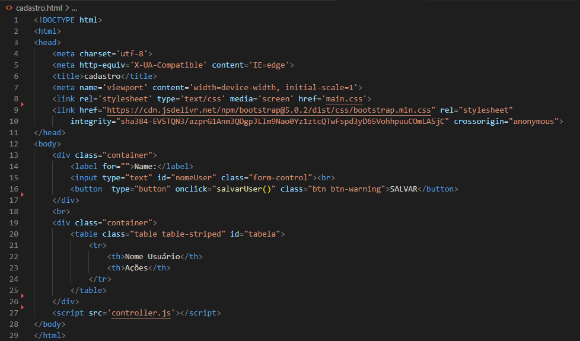

# 📚``login-cad``

* [Introdução](#introdução)
* [Descrição](#descrição)
* [Resultado](#)

# Introdução

## ``Página de Login (index.html)``

>💾A página de login permite que os usuários insiram suas credenciais para acessar o sistema. Ela utiliza HTML e Bootstrap para estruturar o formulário de login. O JavaScript associado (controller.js) valida se os campos de e-mail e senha foram preenchidos antes de redirecionar o usuário para a página de cadastro.

## ``Página de Cadastro (cadastro.html)``

>💾A página de cadastro permite que novos usuários sejam registrados no sistema. Ela inclui um formulário simples para inserir o nome do usuário. O JavaScript (controller.js) armazena os nomes dos usuários em um array sempre que o botão "SALVAR" é clicado.

## ``JavaScript Compartilhado (controller.js)``
>💽O arquivo controller.js contém funções JavaScript que são utilizadas tanto na página de login quanto na página de cadastro. A função acessar() valida o login do usuário na página de login, enquanto salvarUser() armazena os nomes dos usuários na página de cadastro.

> 🚧Esta introdução fornece uma visão geral do projeto interligado, destacando como a página de login redireciona para a página de cadastro após o login bem-sucedido, e como o JavaScript compartilhado gerencia funcionalidades como validação de login e armazenamento de dados de usuários.

# ``Descrição``

## ``1 Página de Login``

>📒A página de login é projetada para permitir que usuários autentiquem-se no sistema fornecendo um e-mail e senha válidos. Utilizando HTML e Bootstrap para estruturação visual, o formulário de login é simples e intuitivo. O JavaScript associado valida se ambos os campos (e-mail e senha) foram preenchidos antes de permitir o acesso à próxima página, que é a página de cadastro.
Tecnologias Utilizadas: HTML, Bootstrap, JavaScript
Funcionalidades Principais:
>* Validação de campos obrigatórios (e-mail e senha).
>* Redirecionamento para a página de cadastro após login bem-sucedido.

## ``2 Página de Cadastro``
>📒A página de cadastro permite que novos usuários sejam registrados no sistema. Após preencher o nome no formulário e clicar em "SALVAR", o JavaScript armazena dinamicamente o nome do usuário em um array. Além disso, a página inclui uma tabela que lista todos os nomes de usuários cadastrados, permitindo futuras interações como edição ou exclusão.
Tecnologias Utilizadas: HTML, Bootstrap, JavaScript
Funcionalidades Principais:
>* Armazenamento dinâmico de nomes de usuários em um array.
>* Exibição dos nomes de usuários cadastrados em uma tabela.
>* Funcionalidades adicionais podem incluir edição ou exclusão de usuários cadastrados.

## ``3. JavaScript Compartilhado (controller.js)``
>📱O arquivo controller.js contém funções JavaScript compartilhadas por ambas as páginas (login e cadastro). Ele gerencia a validação do login na página de login e o armazenamento dinâmico de nomes de usuários na página de cadastro. Além disso, pode incluir funcionalidades adicionais para manipulação dos dados, como atualização da tabela de usuários.
Funcionalidades Compartilhadas:
>* acessar(): Validação de login e redirecionamento para a página de cadastro.
>* salvarUser(): Armazenamento de nomes de usuários em um array e atualização dinâmica da tabela.

🔑Essa descrição oferece uma visão detalhada do projeto interligado de login e cadastro, explicando suas funcionalidades principais e como o JavaScript compartilhado (controller.js) é essencial para ambos os fluxos de trabalho.

# ``Resultado``

